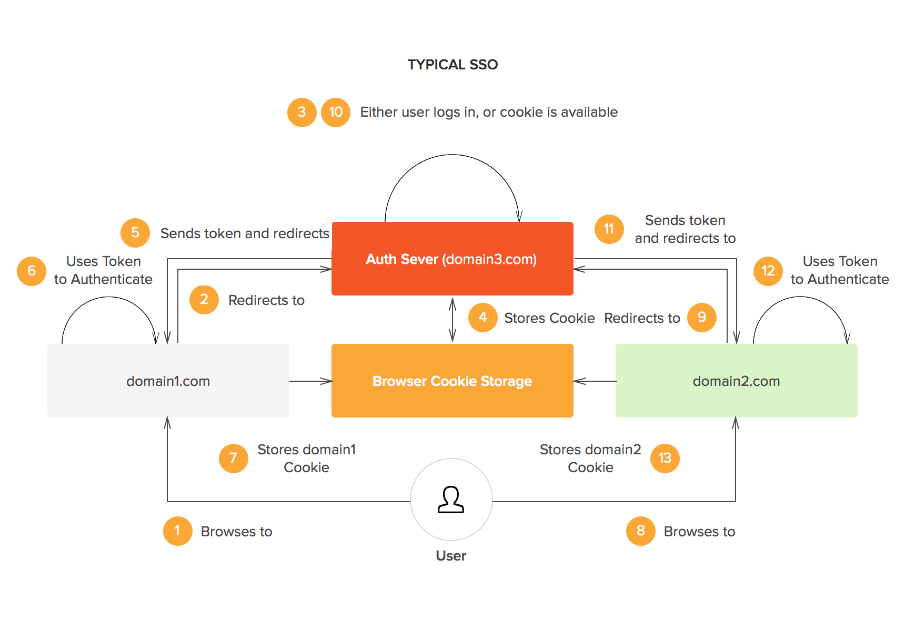

# Single Sign On (SSO)

Inicio de sesión único (SSO) hace referencia a cuando un usuario inicia sesión en una aplicación con un único conjunto de credenciales y, a continuación, inicia sesión automáticamente en varias aplicaciones. Con el inicio de sesión SSO, un usuario obtiene acceso a varios sistemas de software sin mantener diferentes credenciales de inicio de sesión, como nombres de usuario y contraseñas.

Por ejemplo, en el caso de Google con sus diferentes productos, cuando un usuario ingresa a su Gmail, el usuario automáticamente tiene acceso a Youtube, Google Drive, Photos, entre otros productos de Google.


## Diagrama de flujo de una arquitectura típica de SSO



...

## Pasos para correr el proyecto

Estructura del repo

```
sso-arch
│    README.md
└─── images/...
│   
└─── app1
│   │   flask app
│   │   ...
│   
└─── app2
│    │   flask app
│    │   ...
│
└─── auth-server
     │  flask app
     │  ...   
    
```

## Referencias

* [SSO Login: Key Benefits and Implementation](https://dzone.com/articles/sso-login-key-benefits-and-implementation)